# Helen Clayton Celebrancy — Website Updates

Hi Helen,

I've worked through everything in your `Website amendments.docx`, point by point. Below is what's been changed on each page, with screenshots so you can see the results before we put them live.

The structure follows the order of your brief so you can tick things off as you go. There's a short summary at the very end too.

---

## Site-wide changes

A few of your notes applied to the whole site rather than a single page, so I've handled those once and they take effect everywhere:

- **Heading colour.** All the section headings on light backgrounds are now in your darker red — the same style you liked on the Helpful Links page.
- **Red shade — slightly darker.** The site red has been deepened to better match the burgundy in your logo mock-up.
- **Font (Q looking like a 2, J looking like an F).** The serif font has been swapped from *Playfair Display* to *Cormorant Garamond*, which has a clearly-shaped Q and J. This applies to every page.
- **Page navigation.** Every internal link — "Contact Me", "Get to Know Helen", the menu, the My Services tiles — now scrolls to the **top** of the destination page. The My Services tiles also jump straight to the matching section (e.g. "Memorial Services" jumps directly into the Memorial Services area on the Funerals page).
- **Logo.** Your existing logo design has been kept (you said you preferred it to your mock-up), but it's now noticeably bigger and sits on a soft cream circle so it stays clearly visible on top of any photo or video underneath. It no longer animates / moves.

---

## Home page

> *"My logo is too small and can't be seen with the colours…"*
> *"I don't like the video of the couple getting married as the celebrant is obviously not me…"*
> *"My head is cut off in the photo with the married couple. I would like the photo of the Asian couple changed…"*

- The wedding-couple video is gone. The hero now uses real photographs you sent — Tash & Adam's ring exchange, the close-up of their hands and rings, and your photo from the Cheetham wedding. So the celebrant on screen is finally you.
- The bride/groom photo on the "Helping You…" panel uses Tash & Adam's photo and is anchored at the top, so heads aren't cropped.
- The dark "Asian couple" photo is replaced.
- The logo is bigger and visible against any background.

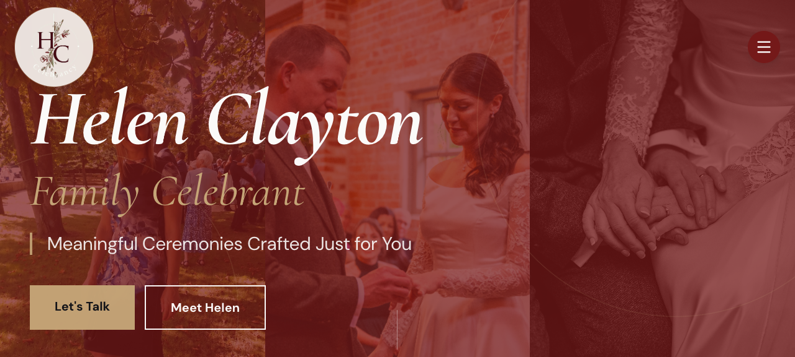

> *"I'd like to change all the headings to red…"*
> *"I love the My Services area…however when you click the links they need to go to correct section."*

- The "My Services" heading is now in your darker red.
- Each service tile now jumps to the right section — Funeral Planning / Eulogy Writing → the Funerals section, Memorial Services → the Memorials section, Scattering of Ashes → the Ashes section, Wedding Ceremonies → Weddings, Vow Renewal → Vow Renewals.

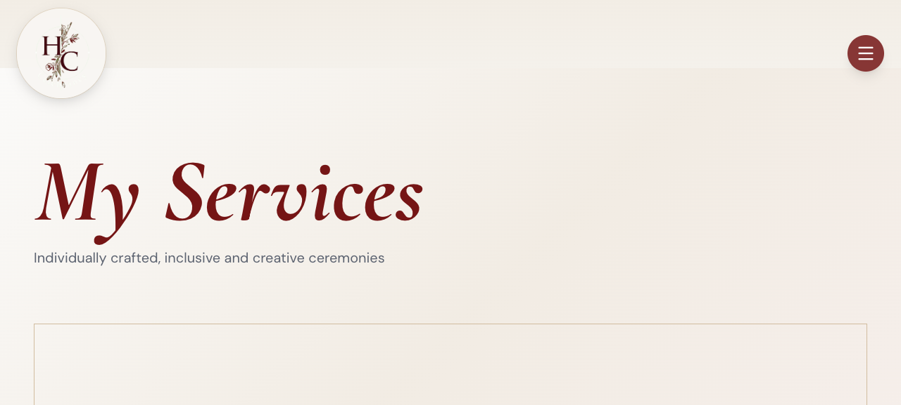

> *"Why choose me – the photo resolution isn't great…"*
> *"When you click on 'Get to know Helen' box it takes you to the bottom of Meet Helen page – this needs to go to the top…"*
> *"I have re-read my 'Why Choose Me' words – would you please change them slightly to read…"*
> *"Why choose me – the photo is zoomed in too far…"*

- Photo replaced with your high-resolution professional bench portrait, no longer over-zoomed (you can see the bench, the brick wall, your dress).
- "Get to Know Helen" now goes to the **top** of the Meet Helen page.
- Wording updated word-for-word as you asked: *"I will bring a calm, caring approach to your ceremony, while taking the time to understand…"* and *"…important moments in their lives, which I have always done with compassion, patience, and understanding."*

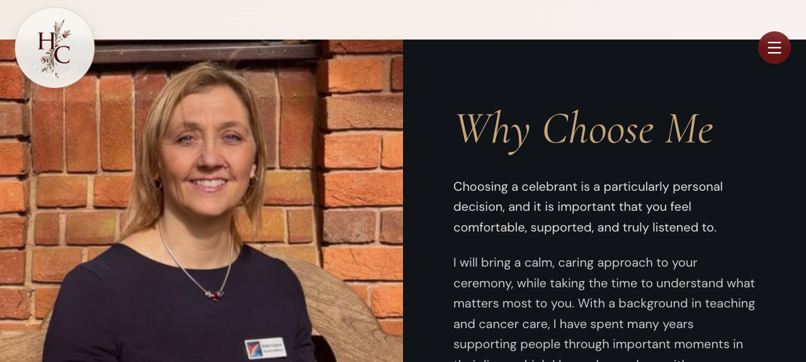

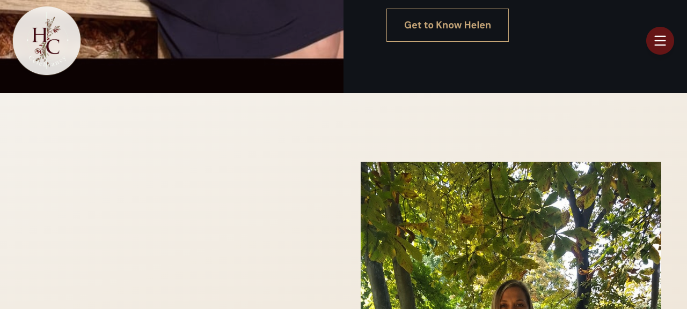

---

## Meet Helen

> *"You can't see me at the top in the photo – if you need another photo please let me know…"*
> *"Again when you click on 'Contact Me' box – it takes you to the bottom of the linked page rather than the top."*

- Your professional portrait is now used at the top of the page, with a much lighter overlay so your face is clearly visible.
- "Contact Me" now goes to the top of the Contact page.

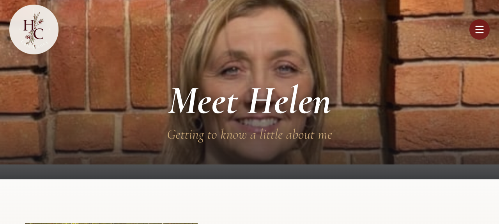

---

## Funerals & Memorials

> *"The photo that goes with Memorial Services I would like this to be more like this please, if they can be adjusted to be portrait?"* (you attached lilies + candles)
> *"The font shows the Q's looking like a 2 – I think this needs to be changed across the whole website please."*
> *"Again when you click on 'Contact Me' box – it takes you to the bottom of the linked page…"*

- The Memorial Services photo is now a portrait-orientation image of white lilies with softly burning candles, in the style you sent.
- The Q's now look like proper Q's (font change is global).
- "Contact Me" goes to the top.

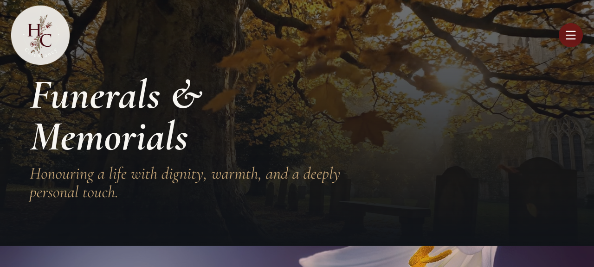

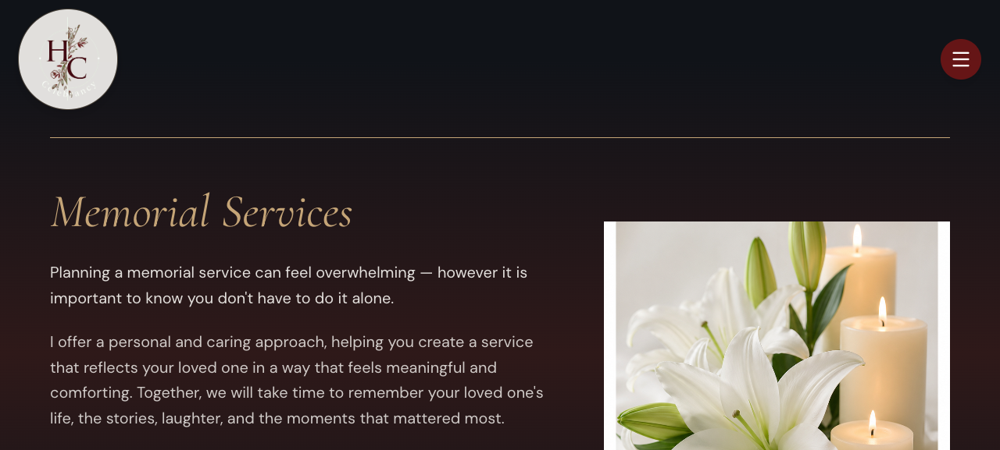

---

## Weddings & Vow Renewals

> *"Again not the right video as the celebrant is obviously not me. Please use any of the photos I have sent to you that you feel is appropriate…"*
> *"Vow renewal photo I don't like that photo – sorry. I do like this one from my home page – would it be possible to use that one instead please?"*

- The video is replaced with Tash & Adam's photographs (ring exchange + hands and rings) — actual photos from a ceremony you led.
- The Vow Renewals section now uses the **exact** photo you pointed at in your brief — the older couple walking hand-in-hand through the rose garden (the one that was on the home page Vow Renewal tile). I had originally picked a different photo for this and you were quite right to question it — now corrected.

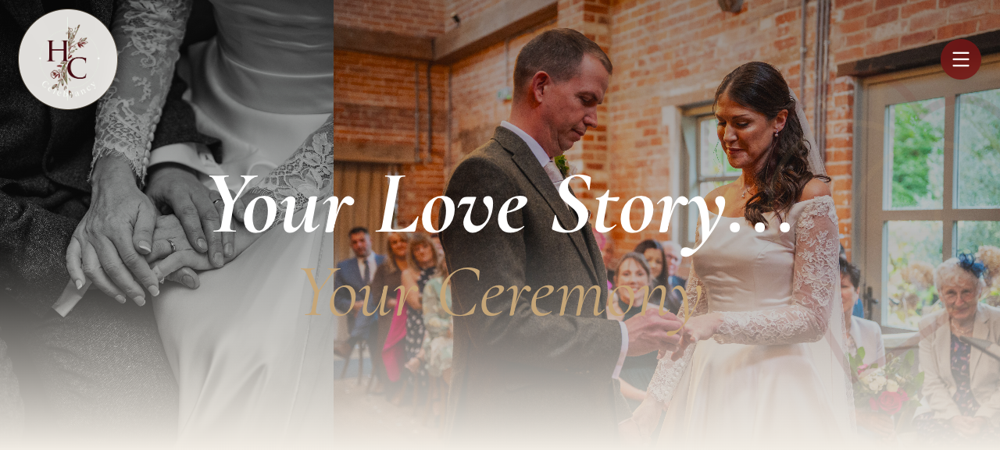

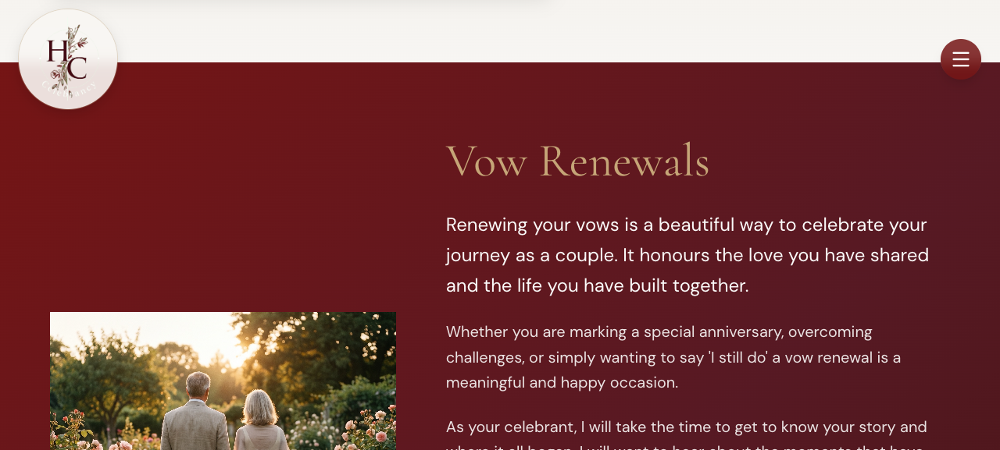

---

## Costs

> *"Please can the figure just be there rather than the number scrolling."*
> *"The background photo of the funerals I would prefer that is was the crematorium rather than the lady…"*
> *"The font has the J (Just honest, heartfelt service.) looking like an F – what do you think, should it be different please?"*

- The number-scrolling animation is gone. The prices (£250, £650, £200, £80) are simply *there* on the page now.
- The Funerals card background is now the crematorium image (with a soft cream overlay so the writing stays clearly readable). The Memorial Services card uses the lighter lilies + candles image, which works nicely as the lighter alternative you mentioned.
- The "Just honest, heartfelt service." J is now clearly a J (font change is global).

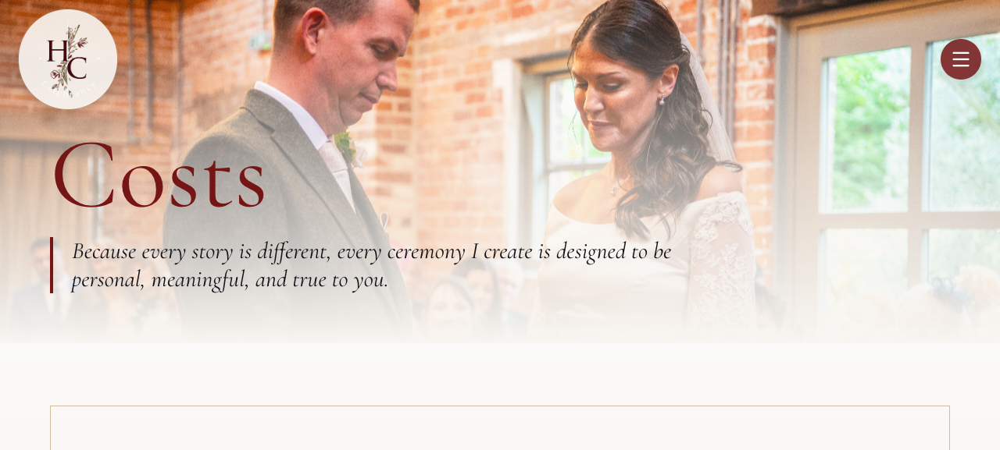

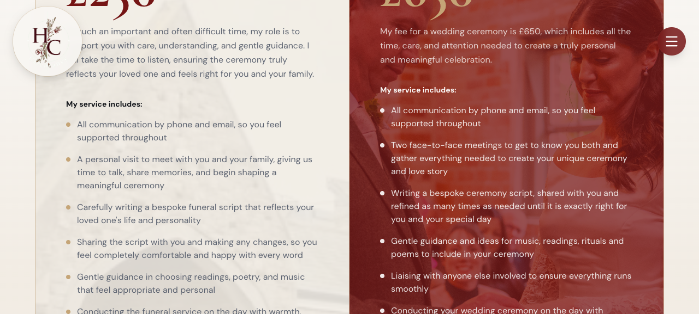

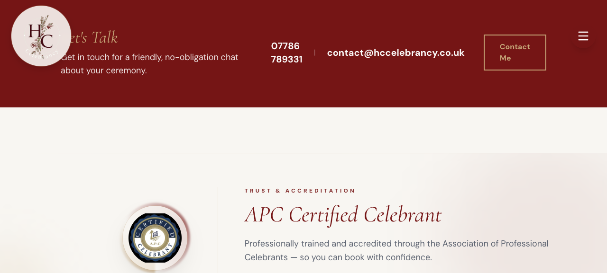

---

## FAQs

> *"I would prefer a slightly different font so that the Q looks like a Q rather than a 2 please."*
> *"You also can't see & Answers with the background."*
> *"I do really like the Sunflowers though – more appropriate than you would know…thank you."*

- Q now reads as Q (font change is global).
- The "& Answers" subtitle has a stronger dark wash and a soft drop-shadow behind it, so it's now clearly legible against the sunflower background.
- The sunflowers are kept exactly as they were.

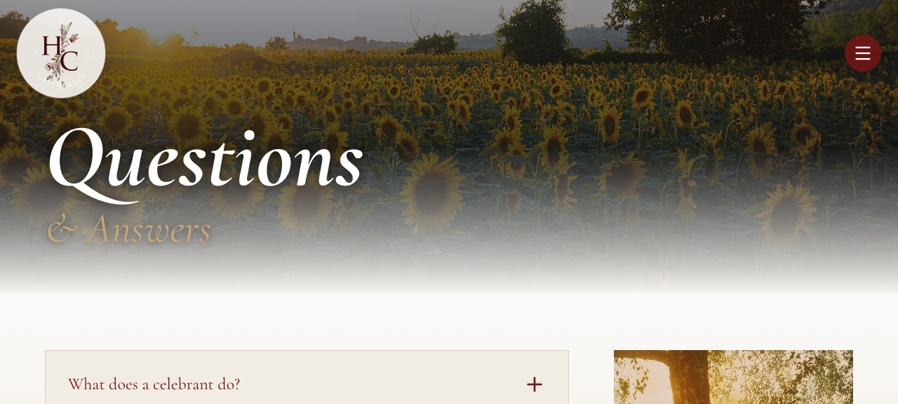

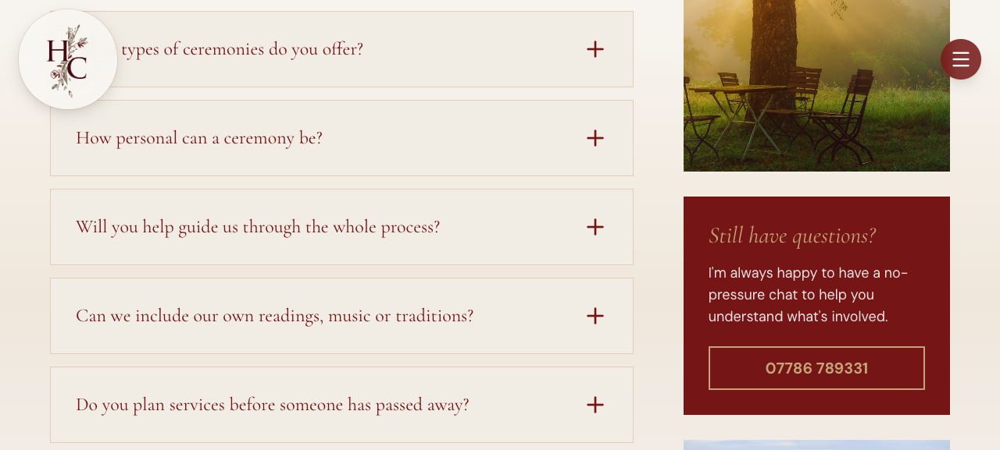

---

## Helpful Links

> *"The photo of the lady, I think I would rather that was a photo of something like this please"* (you attached the butterflies / cupped-hands sunset image)
> *"Again when you click on 'Contact Me' box – it takes you to the bottom of the linked page…"*

- The hero now features a proper high-resolution version of the cupped-hands-releasing-butterflies image you attached. (The thumbnail in your Word document was very small, so I had a higher-resolution version produced in the same style — same hands, same butterflies, same warm sunset light.)
- "Contact Me" goes to the top.

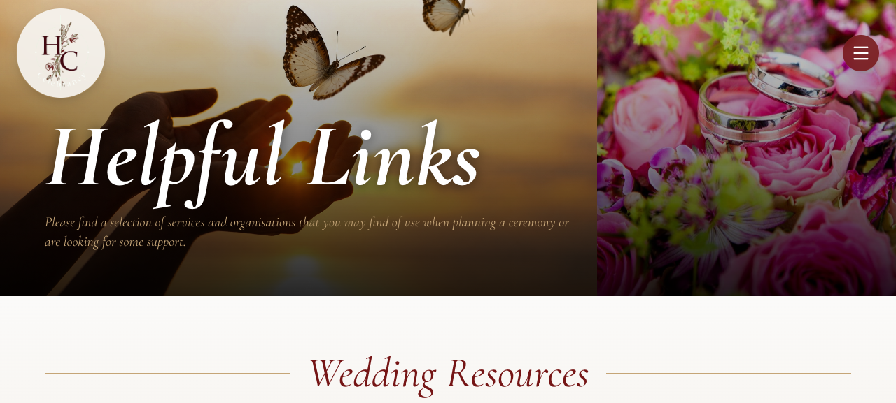

---

## Let's Talk (Contact)

> *"Photo of me is covered – needs to be visible…"*
> *"…the photo of the couple cutting the cake can't be seen either."*
> *"There is a random box to the right of this photo, can this be removed please."*
> *"You can't see me!! …Can we remove the full stop on the heading please."*

- The full stop after "Let's Talk" is gone — heading reads "Let's Talk".
- Your portrait is now clearly visible — the dark gradient that was hiding most of your face has been pulled right back to a thin band at the very bottom edge.
- The hard-to-see ceremony photo is replaced with the Tash & Adam ring exchange shot at full opacity.
- The two decorative offset boxes (the small tan square and the bordered red square) are removed — that's the "random box" you spotted.

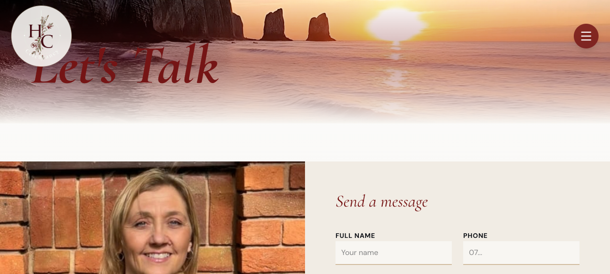

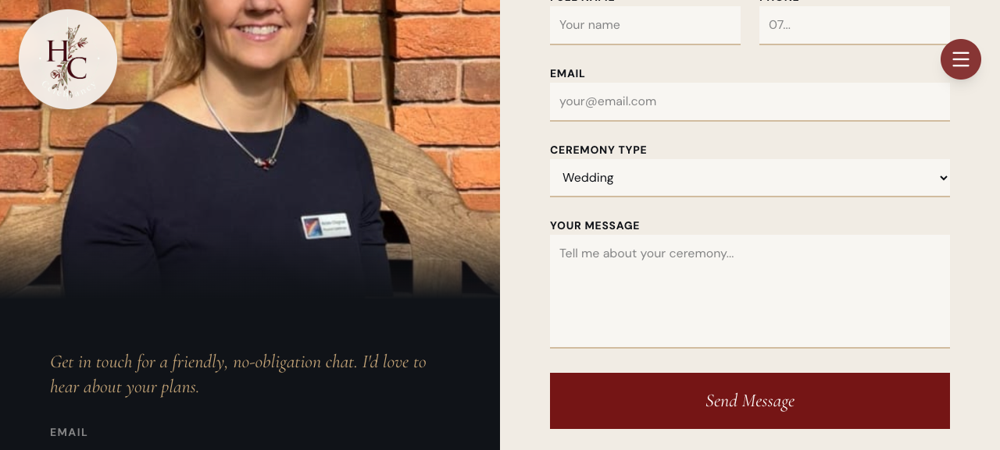

---

## A note on the videos

You wrote: *"I am happy for these to be generated to be moving images."* For now I've gone with the safer route of using a still photo collage of your own photos in both hero areas (Home and Weddings) — no AI motion of you or your couples. If you'd like us to commission proper animated versions of those photos at any point, that's a quick follow-up — just say the word.

---

## Quick checklist of every point in your brief

| Page | Your request | Done |
|---|---|:---:|
| Home | Logo bigger, better colour, doesn't animate down the page | ✅ |
| Home | Replace video where the celebrant isn't you | ✅ |
| Home | Head not cut off in bride/groom photo | ✅ |
| Home | Replace the dark "Asian couple" photo | ✅ |
| Site-wide | All headings red (like Helpful Links page) | ✅ |
| Home | My Services tiles go to the right section | ✅ |
| Home | Why Choose Me — better resolution photo | ✅ |
| Home | "Get to Know Helen" → top of Meet Helen | ✅ |
| Home | Why Choose Me — photo not zoomed in so far | ✅ |
| Home | Why Choose Me — exact wording tweaks | ✅ |
| Contact | "Contact Me" → top of Let's Talk | ✅ |
| Contact | Photo of you visible | ✅ |
| Contact | Cake-cutting / ceremony photo visible | ✅ |
| Contact | Random box removed | ✅ |
| Contact | Full stop removed from heading | ✅ |
| Meet Helen | Top photo — you visible | ✅ |
| Meet Helen | "Contact Me" → top | ✅ |
| FAQ | Q looks like Q (font change) | ✅ |
| FAQ | "& Answers" visible against sunflowers | ✅ |
| FAQ | Sunflowers kept | ✅ |
| Helpful Links | Butterflies / cupped-hands sunset photo | ✅ |
| Costs | Number-scrolling removed (prices static) | ✅ |
| Costs | Funerals card background → crematorium | ✅ |
| Costs | "Just honest…" J reads as J (font fix) | ✅ |
| Weddings | Replace video where celebrant isn't you | ✅ |
| Weddings | Vow renewal photo → the rose-garden one | ✅ |
| Funerals | Memorial Services photo → portrait lilies + candles | ✅ |
| Funerals | Q's no longer look like 2 | ✅ |
| Site-wide | All page links go to top of page | ✅ |
| Site-wide | Red slightly darker | ✅ |
| Logo | Kept your design, just bigger and visible | ✅ |

If anything's still not quite right, jot a note next to the relevant screenshot and we'll get it sorted.

— Jack
